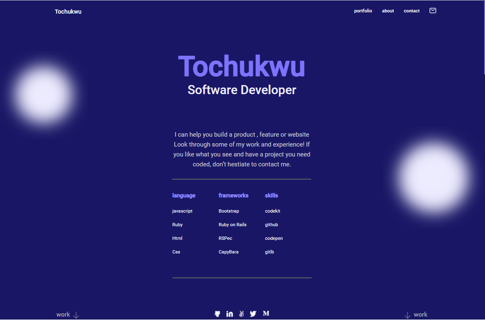
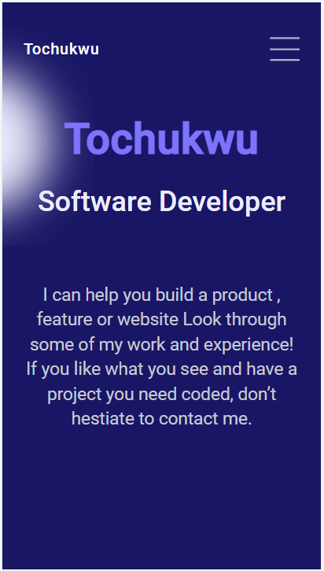
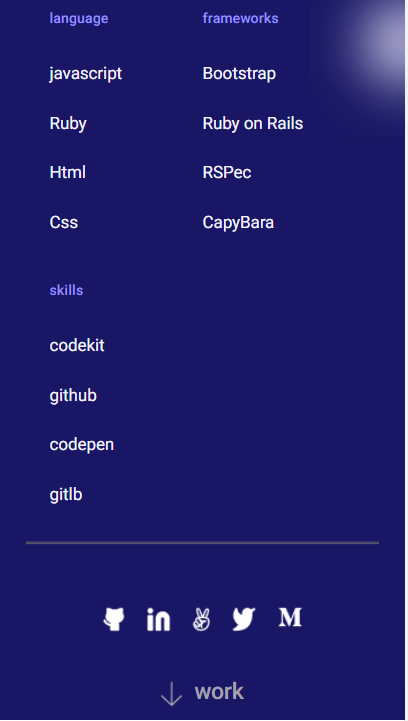
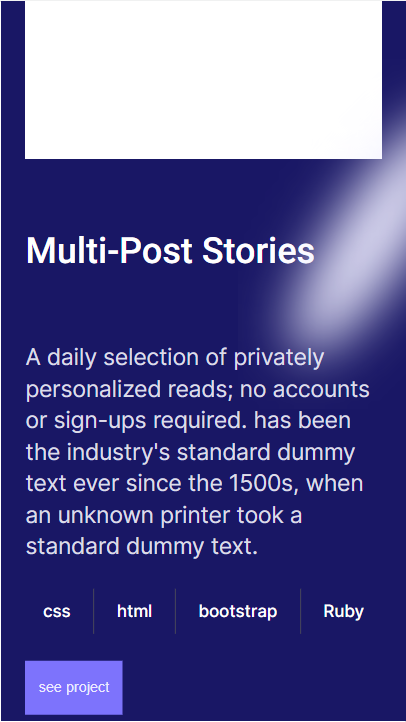

# Portfolio: setup mobile and desktop version

## Description
> this is mobile and desktop version of my personal portfolio website

Desktop view                                      |  Mobile view Header
:------------------------------------------------:|:-----------------------------------------------:
                     |  

Frameworks and languages                          |  Projects
:------------------------------------------------:|:-----------------------------------------------:
                         |  
 

## Built With

- html
- css

## Procedure to clone project

from your terminal type git clone https://github.com/xtrahuman/portfolio_website.git

## project link

[site link](https://xtrahuman.github.io/portfolio_website/)

## Author

👤 **Author**

- GitHub: [@xtrahuman](https://github.com/xtrahuman)
- Twitter: [@xtrahuman](https://twitter.com/xtrahuman)
- LinkedIn: [LinkedIn](https://linkedin.com/in/tochukwu-okpara-449528197)

## 🤝 Contributing

Contributions, issues, and feature requests are welcome!

Feel free to check the [issues page](../../issues/).

## Show your support

Give a ⭐️ if you like this project!

## 📝 License

This project is [MIT](./MIT.md) licensed.

